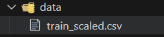
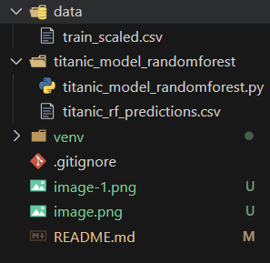
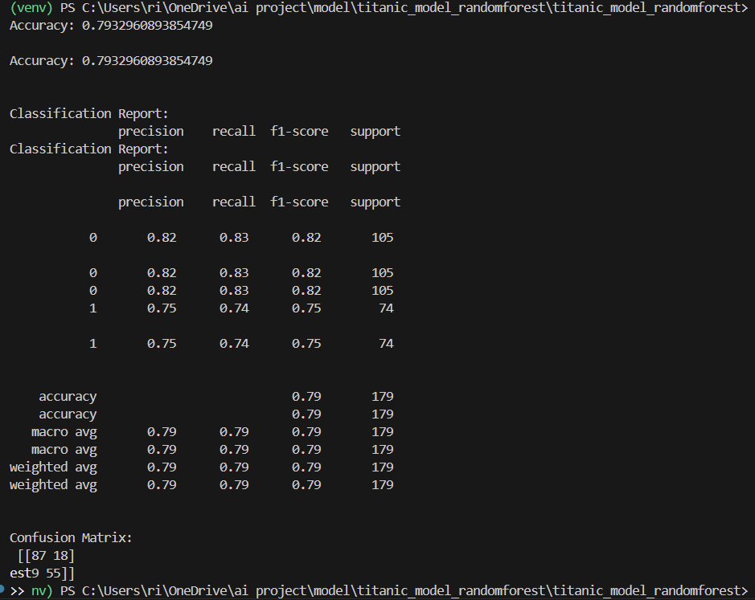
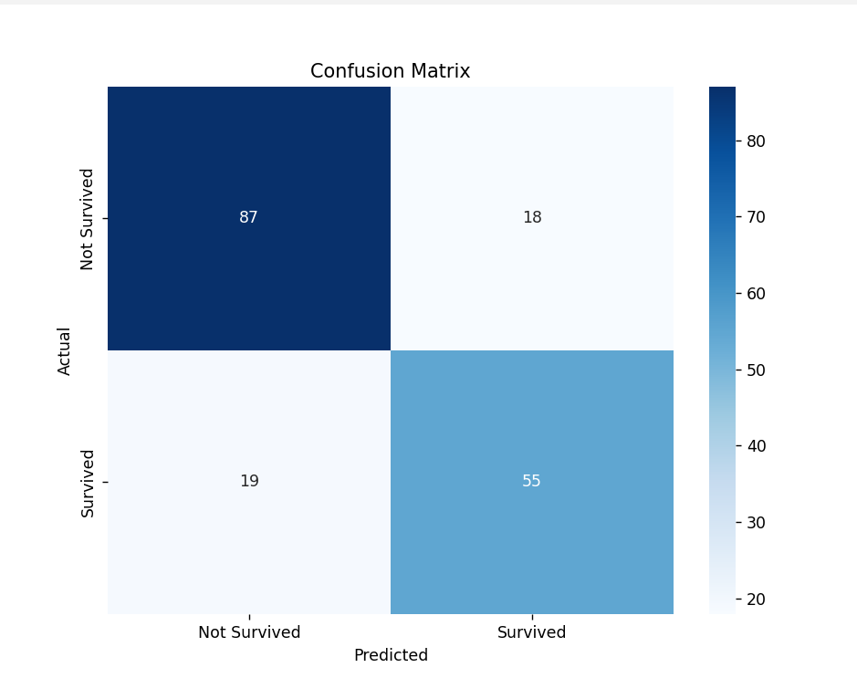

# Titanic Survival Prediction with Random Forest

## Overview
This project applies a **Random Forest Classifier** to predict passenger survival on the Titanic using a **preprocessed dataset** (`train_scaled.csv`). The data has been cleaned, encoded, and scaled to ensure optimal model performance.

**Key highlights:**
- End-to-end ML workflow: data loading → model training → evaluation → visualization.
- Output includes accuracy, classification report, confusion matrix, and saved predictions.

---

## Table of Contents
- [Overview](#overview)
- [Features](#features)
- [Dataset](#dataset)
- [Project Structure](#project-structure)
- [Installation](#installation)
- [Usage](#usage)
- [Output Details](#output-details)
- [Analysis](#analysis)
- [Potential Improvements](#potential-improvements)
- [Troubleshooting](#troubleshooting)
- [License](#license)
- [Author](#author)

---

## Features
- Loads and processes a **scaled and encoded Titanic dataset**.
- Splits data into **train/test** sets (80/20).
- Trains a **Random Forest model** with default hyperparameters.
- Evaluates model performance with:
  - Accuracy
  - Classification report
  - Confusion matrix (heatmap)
- Saves predictions to CSV.

---

## Dataset
Located in the `data/` directory:

- **Rows:** 891 passenger records
- **Target variable:** `Survived` (0 = Not Survived, 1 = Survived)
- **Features:**
  - PassengerId, Pclass, Age, SibSp, Parch, Fare, Sex_male, Embarked_Q, Embarked_S
  - Deck_* (one-hot encoded)
- **Preprocessing:**
  - Numerical features scaled
  - Categorical features one-hot encoded

📷 

---

## Project Structure
```plaintext
titanic_model_randomforest/
├── data/
│   └── train_scaled.csv
├── titanic_model_randomforest/
│   ├── titanic_model_randomforest.py
│   ├── titanic_rf_predictions.csv (generated)
│   └── README.md
└── venv/ (virtual environment)
```

📷 

---

## Installation

### 1. Clone the repository
```bash
git clone https://github.com/username/titanic_model_randomforest.git
cd titanic_model_randomforest
```

### 2. Create & activate virtual environment
```bash
python -m venv venv
.env\Scripts\activate  # Windows
# source venv/bin/activate # Mac/Linux
```

### 3. Install dependencies
```bash
pip install pandas scikit-learn seaborn matplotlib
```

---

## Usage

1. **Ensure dataset exists**
   Verify `train_scaled.csv` is in `data/` directory.

2. **Run the script**
```bash
cd titanic_model_randomforest
python titanic_model_randomforest.py
```

3. **Expected output**
- Accuracy score
- Classification report
- Confusion matrix heatmap
- Predictions saved to `titanic_rf_predictions.csv`

📷 

---

## Output Details

**Sample console output:**
```plaintext
Accuracy: 0.7932960893854749
Classification Report:
               precision recall f1-score support
           0       0.82      0.83      0.82       105
           1       0.75      0.74      0.75        74
    accuracy                           0.79       179
```

📷 

---

## Analysis
- Accuracy ~79%
- Model predicts **non-survivors** slightly better than survivors.
- Slight class imbalance (105 vs. 74 in test set) affects precision/recall for `Survived`.

---

## Potential Improvements
- Hyperparameter tuning (`GridSearchCV`)
- Feature importance analysis (`rf_model.feature_importances_`)
- Cross-validation for more robust evaluation
- Address class imbalance with SMOTE or class weights
- Additional evaluation metrics like ROC-AUC

---

## Troubleshooting
- **FileNotFoundError** → Ensure correct dataset path.
- **ModuleNotFoundError** → Install dependencies in your active virtual environment.
- **Plot not showing** → Check Matplotlib backend settings.

---

## License
This project is licensed under the MIT License. See `LICENSE` for details.

---

## Author
Developed as part of an AI project to demonstrate ML workflows with Titanic data.


---

## Workflow Diagram

> Visual overview of the end-to-end pipeline. GitHub renders Mermaid automatically.

flowchart LR
    A[Raw Titanic Data<br/>CSV] --> B[Data Inspection<br/>nulls, dtypes, duplicates]
    B --> C[Data Cleaning<br/>impute/drop, drop leaks]
    C --> D[EDA (Optional)<br/>distributions, correlations]
    D --> E[Feature Processing<br/>derive features]
    E --> F[Encoding<br/>one-hot categorical]
    F --> G[Scaling<br/>standardize numeric]
    G --> H[Train/Test Split<br/>80/20]
    H --> I[Model Training<br/>RandomForestClassifier]
    I --> J[Evaluation<br/>accuracy, report, confusion matrix]
    J --> K[Artifacts<br/>predictions.csv, plots]
    K --> L[Next Steps<br/>tuning, CV, importance]
```

📷 

